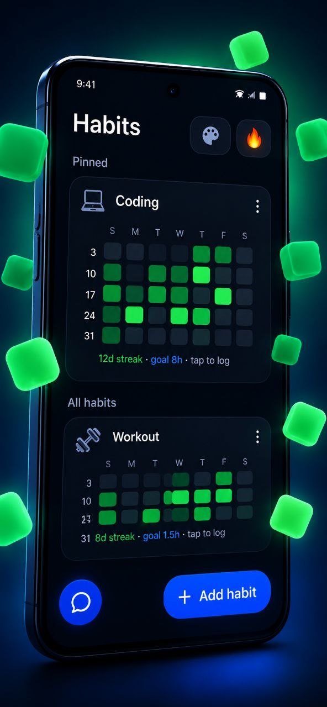
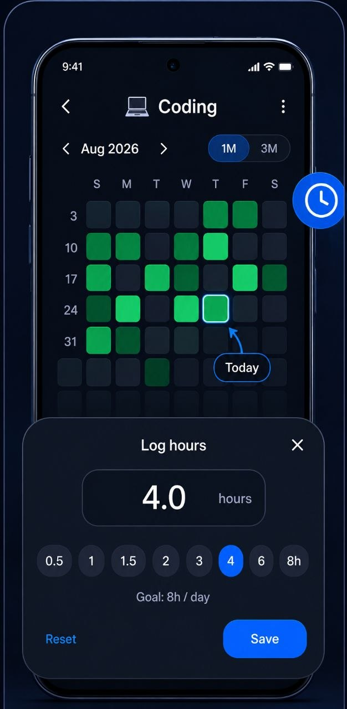
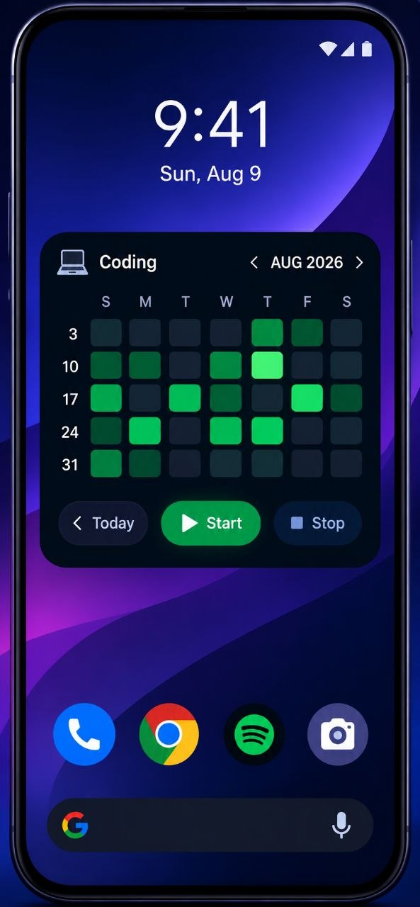
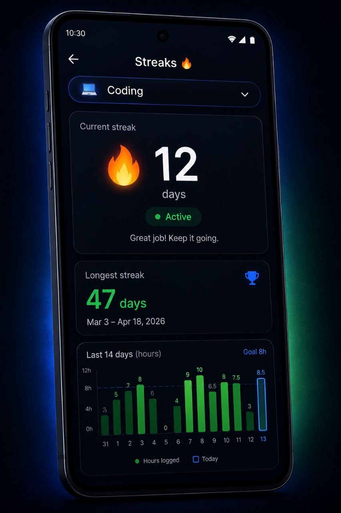

# Cell

A friendly habit tracker that puts your month grid right on the home screen. Log a little time each day and watch the squares fill in, one by one.

Cell is named after those squares. Each day is one cell. The more hours you log, the darker it gets. Over a month you see a picture of your consistency that a checklist just cannot give you.

## Screenshots

A quick tour of what you meet on first launch.

| Welcome | Log hours | Home screen widget | Streaks |
|---|---|---|---|
|  |  |  |  |

## Features

- A native Android widget that renders your month grid on the home screen. Add one per habit, and page through months without opening the app.
- Hour logging with an input that auto-formats as you type. Type `2:30` or `2.5` and it just works.
- Daily goals per habit, with cell shading that scales to your goal.
- Streaks that stay honest. Skip today and your streak turns at risk. Skip two days and it breaks.
- A built-in count-up timer that keeps running as a foreground service when you leave the app.
- Dark and light themes with a few accent palettes to pick from.
- First-run onboarding screens so a new phone feels familiar right away.

## Getting started

Cell is a React Native app. From the project folder:

```
npm install
npm start
npm run android
```

That runs it on a connected device or emulator. The widget needs Android, and the app itself also builds for iOS if you ever want it there.

## Usage

Tap any day on the grid to log hours. You can backdate to fix a missed day. The daily goal is per habit (8 hours by default), so a light square means something different on a habit with a 20-hour day than on one with a 2-hour day.

Streaks show up as a number with a label, so you always know whether today counts or whether you need to act before the streak slips.

## Project layout

```
App.tsx                       app UI
src/hoursInput.ts             hh:mm input mask
src/streaks.ts                streak math
src/levels.ts                 cell shading levels
src/Onboarding.tsx            first-run screens
src/HabitGrid.tsx             month grid components
android/app/src/main/java/com/com.habittrackerwidget/
                              native widget, timer service, config
```

## Tests

```
npm test
npm run lint
npx tsc --noEmit
```

Jest covers the streak math, the shading levels, the hour input mask, and the onboarding screens.

## Building a release APK

```
cd android
./gradlew assembleRelease
```

Set `JAVA_HOME` to the Android Studio JBR if Gradle cannot find Java. The APK lands in `android/app/build/outputs/apk/release/app-release.apk`.

## Data

No account, no server, no signup. Everything is stored on your device.

## Stack

React Native 0.86 and React 19, TypeScript end to end. The widget side is Kotlin: GridRenderer, HabitStore, Streaks, ThemePalette, and a timer service, all reading the same SharedPreferences the app writes.
